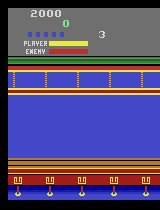

```markdown
# Atari KungFuMaster A3C Agent

This project implements an A3C (Asynchronous Advantage Actor-Critic) agent to play the **KungFuMaster** game from the Atari environment using `gymnasium`, `ale-py`, and `PyTorch`. The agent is trained and evaluated over multiple environments, and the results are visualized as a GIF.

## Project Structure

- `models/` - Contains the model architecture and network code.
- `main.ipynb` - The main Jupyter Notebook for training, evaluating, and visualizing the agent.
- `main.py` - Python script for training the agent.
- `requirements.txt` - List of dependencies for the project.
- `README.md` - Project documentation.
- `video.gif` - The output GIF of the agent's gameplay after training and evaluation.
- 'evaluate.py' - Python script for generating the agent's performance in the environment


## Requirements

To run the project, you need the following Python packages. Install them using the following command:

```bash
pip install -r requirements.txt
```

### Dependencies

- `gymnasium` - Provides the environment for the Atari games.
- `ale-py` - A Python wrapper for the Arcade Learning Environment (ALE).
- `torch` - The deep learning framework used for the model.
- `opencv-python` - For image processing tasks.
- `numpy` - For numerical operations.
- `imageio` - For creating and saving the GIF of the agent's actions.
- `tqdm` - For the progress bar during training.

## Setup

### 1. Clone the Repository

```bash
git clone <repo_url>
cd <repo_directory>
```

### 2. Install Dependencies

Run the following command to install all required libraries:

```bash
pip install -r requirements.txt
```

### 3. Train the Agent

To start training the A3C agent, run the following script:

```bash
python main.py
```

This will begin training the agent across multiple environments. The agent will improve over time as it learns how to play KungFuMaster.

### 4. Evaluate the Agent

After training, you can evaluate the agent's performance by running:

```bash
python evaluate.py
```

This will generate a GIF of the agent’s performance in the environment.

### 5. Visualize the Result

Once the evaluation is complete, a `video.gif` file will be created. You can display the GIF directly in Jupyter or view it in a browser using the `show_video()` function:

```python
show_video_of_model(agent, env)
show_video()
```

This will display the agent's gameplay as a GIF.


## Training Process

- **A3C Architecture**: The project implements the A3C reinforcement learning algorithm. It utilizes convolutional neural networks (CNNs) to process the Atari frames and makes predictions for actions based on the actor-critic methodology.
- **Multi-Environment Setup**: The agent is trained using 10 parallel environments for better stability and faster training.
- **Model Architecture**: The network consists of 3 convolutional layers followed by fully connected layers. The agent uses a policy network for action prediction and a value network for state evaluation.
